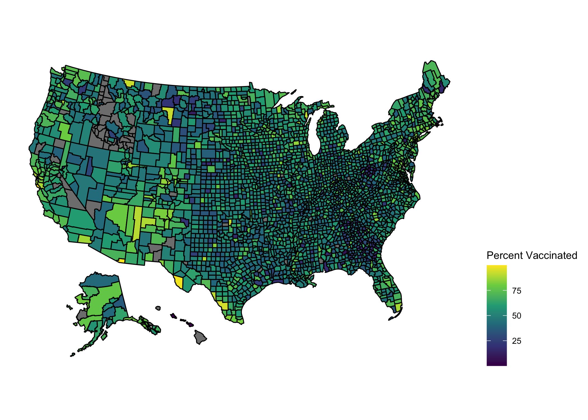
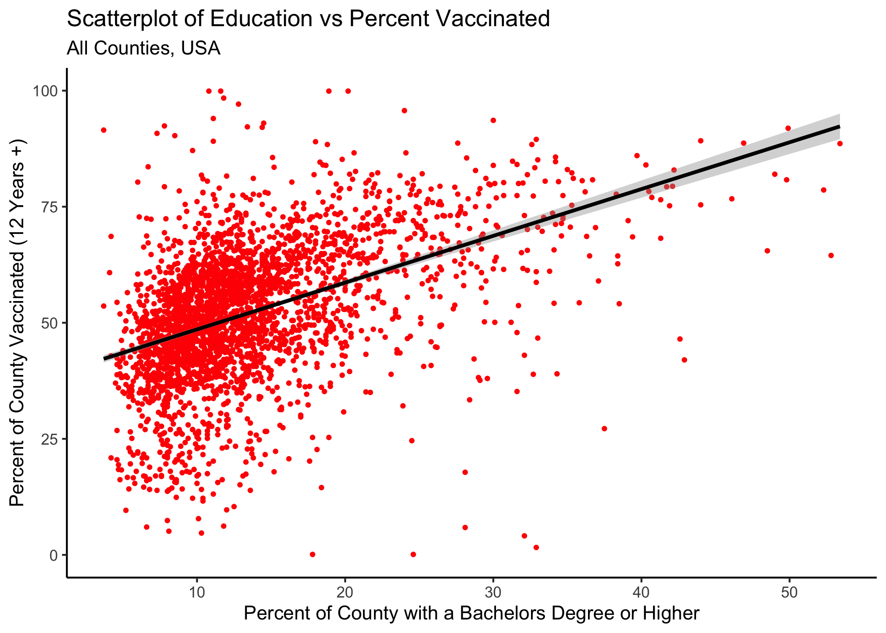
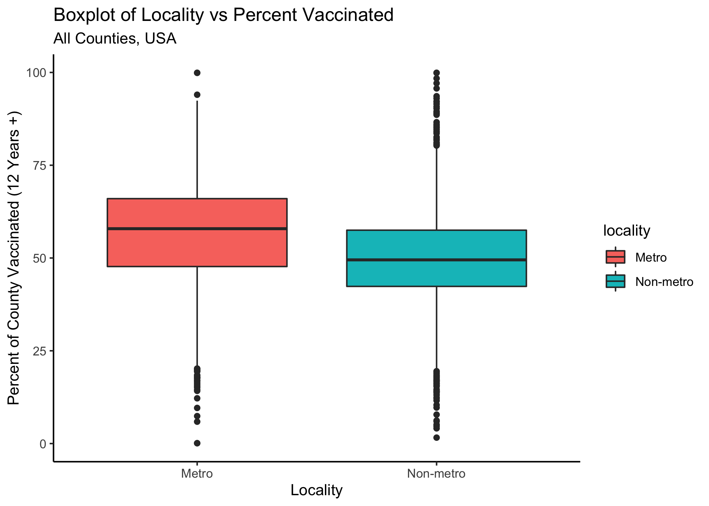

<div style="margin-bottom:50px;">
</div>

## Abstract

Several studies have examined characteristics of those who chose not to be vaccinated against COVID-19, and some have found that individuals with lower education levels are less likely receive the vaccine (@RNN1, @RN6). Although this has been explored using surveys from individual participants on a smaller scale, there are no current reports or published papers that have studied this relationship using aggregate data from all counties in the US. We examined the relationship between education level (percent of adults who have a bachelors degree or higher) and vaccination rate (for people over age 12) at the county level for all counties in the 50 US states and explored other county characteristics (median income, poverty rate, locality, unemployment rate) that might predict vaccination rates. We used public data from CDC and the USDA for vaccination rates, education level, and other characteristics. We reported descriptive statistics for all US counties and plotted vaccination rates on the US map, locating a cluster of low rates in the southeast region. We ran several machine learning models with a test/train split and a 5-fold cross-validation, 5 times repeated using the tidymodels package in R, comparing the root mean square error (RMSE) and diagnostic plots to arrive at the chosen model and determine which variables were important. The results of the descriptive analysis and modeling show that education was the most important variable in predicting county vaccination rates. Other variables did not lower the RMSE or explain much of the outcome. Based on the simple model, a one unit increase in percent of county with bachelor’s degree is associated with a 1 unit increase in vaccination rate (p< 0.0001). The research team recommends that US public health officials prioritize vaccination campaigns in southeastern counties with low education levels.

<div style="margin-bottom:50px;">
</div>

## Introduction

As of December 1, 2021, the United States has reported a total of 48 million cases of COVID-19, resulting in 787,000 deaths (@RNN). In early 2021, both the Moderna and Pfizer vaccines were rolled out in the US, followed by Johnson and Johnson's in March. All three vaccines have been proven safe and effective in preventing infection, hospitalization, and death, but low vaccination uptake continues to be an issue in battling the pandemic in the United States and throughout the world (@RNN3). To date, the US reports 59.8 percent of the total population as fully vaccinated (@RNN). Studies have explored characteristics of those individuals who decide not to be vaccinated (@RN4, @RN5, @RN3). Several sources have reported the relationship between education level and COVID-19 vaccination at the individual level using data from surveys and qualitative research (@RN2, @RN1). KHN released a report on June 11 that outlines the profile of the unvaccinated. They state that, “compared to those who have received a covid-19 vaccine, unvaccinated adults are younger, less educated, more likely to be republicans, people of color, and uninsured.” (@RN6) Another recent study on vaccine hesitancy conducted by the Pew Research Center found that education was a more important factor than race in vaccine uptake. Using their sample of 10,348 participants, they report an 81% vaccination rate (at least one dose) among those with a college degree and a 66% vaccination rate among those with no college degree (@RNN1). Although this has been examined using surveys from individual participants on a smaller scale, there are no current reports or published papers that have studied this relationship using aggregate data from all counties in the US. 

The following analysis aims to examine the relationship between education level and vaccination rate (for people over age 12) at the county level for all counties in the 50 US states and explore other county characteristics that might predict vaccination rates. For the outcome, we use public data from CDC on vaccination rates by county. In order to obtain county characteristics, we pull data from several different sources that are available on the USDA’s Economic Research website. As new variants of SARS-CoV-2 have emerged in the summer and fall, it is important to find new ways to tailor vaccine campaigns to increase uptake in US. This analysis could provide more information on the association between education and vaccination rate on a larger scale and aid public health officials in targeting areas most in need of aggressive vaccination campaigns and intervention measures.


## Methods

The main outcome for this analysis is percent of eligible people (age 12+) in a county that have been fully vaccinated. It was obtained from the CDC’s open-source dataset, "COVID-19 Vaccinations in the United States, County." This dataset “represents all vaccine partners including jurisdictional partner clinics, retail pharmacies, long-term care facilities, dialysis centers, Federal Emergency Management Agency and Health Resources and Services Administration partner sites, and federal entity facilities.” The data represents vaccination percentages up to 11/10/2021.

The main exposure for the analysis is percent of adults in each county who have a bachelors degree or higher. The most current county level data on education is available on the USDA’s Economic Research website. This dataset includes information on education level for all years.  We subset the data to only include observations from the most current year. The most current calculations of education level by county are 5-year averages based on 2015-2019 and they come from the Census Bureau’s American Community Survey. 

There were other covariates that we examinined including poverty, unemployment, median household income, and locality (urban or rural). US County data on poverty, unemployment, and median household income were available through USDA Economic Research Service website. The county poverty estimates are model-based estimates from the U.S. Census Bureau's Small Area Income and Poverty Estimate (SAIPE) program. The county unemployment rates are from the Bureau of Labor Statistics (BLS) Local Area Unemployment Statistics (LAUS) program. The county median household income variable comes from the U.S. Census Bureau's Small Area Income and Poverty Estimate (SAIPE) program. The locality (urban or rural) variable comes from from the Rural-Urban Continuum Codes Dataset which is also managed by USDA.

In order to explore the possible relationship between education level and vaccination rates at the county level, data was extracted from the several sources mentioned above and then merged together. Most county level data include a Federal Information Processing Standards (FIPS) number. This variable was used as the ID variable when merging the datasets. After merging the data, cleaning and processing was performed. The data was subset to only include counties from the 50 states and Washington DC. 

## Statistical Analysis 

Medians, minimums, maximums, and interquartile ranges (IQRs) were calculated for the main outcome and other continuous covariates. Frequencies and proportions were calculated for the one categorical variable, locality. The maps package in R was used to geographically plot vaccination rates for each county in the US. We used scatter plots and linear regression overlays to display the linear relationship between county vaccination rate over twelve years of age and each continuous variable.  Stratified boxplots were used to graphically display differences in the outcome with regard to the one categorical variable, locality. We tested all predictors for collinearity and removed those that were highly correlated with our main predictor of interest.

Simple linear regression models were used to examine the relationship between each covariate and the outcome. We present regression beta coefficients and p-values for each of these crude model estimates. A multivariate regression model was used to calculate adjusted estimates for each covariate and the outcome. Performance statistics were calculated for each regression model. All modeling was performed using the R package, tidymodels.  

After fitting the simple and complex models, we performed a test/train split on the data, randomly sampling 75% of the data for the training set and 25% for the test set. We stratified this by our main outcome, county vaccination rate and then ran several different models on the training data using the tidymodels framework in R. We plotted diagnostics on all models and used the root mean square error (RMSE) as our metric when comparing them in order to select the best model to fit the data and answer our research questions. We used a 5-fold cross-validation, 5 times repeated, creating a resample object for the training data with these specifications and ran least absolute shrinkage and selection operator (LASSO) and decision tree models to the data, plotting diagnostics and calculating RMSE for both. We selected our best fit model based upon these plots and metrics.


## Results: Descriptive Statistics 
After cleaning the data and subsetting to only counties from the US mainland and Alaska/Hawaii, the sample had 3,141 observations which represent each county. The median (IQR) vaccination rate for those age twelve and older for all US counties by November 10, 20021 was 51.9% (43.6-61.1). The median (IQR) bachelor’s degree percentage for all US counties was 11.8% (9.2%-15.6%).  The median (IQR) unemployment rate was 6.5% (5.2-8),  poverty rate was 13.4% (10.4-17.5), and median household income was 53,341 (46,243-62,059). The medians and IQRs for all continuous variables are displayed in Table 1. Regarding locality, the one categorical variable,  a majority (63%) of counties in the US were classified as non-metro. Regarding missing data, 56 (1.78%) of the counties included in this analysis were missing information from CDC on our main outcome, 8 (0.25%) were missing information on our main exposure, and one county (0.03%) was missing data on locality. This table of missing data is displayed in the supplemental. 

Figure 1 displays vaccination rates for each county on the US map. The darker (purple) shading indicates lower vaccination rates closer to 0 and the lighter (yellow) shades indicate higher vaccination rates closer to 100. The counties that were shaded gray indicate that information on vaccination rate was missing from CDC. Below we see a cluster of counties with low vaccination rates in the southeast, specifically in the state of Georgia. There are also several counties with missing data on vaccination rate in the north west, specifically in the state of Idaho and in Alaska and Hawaii. Figure 2 displays the scatter plot of percent of county with a bachelors degree or higher and percent vaccination rate over 12 years old. From this exploratory figure, we can see the appearance of a possible linear trend. This is displayed by the regression overlay. Figure 3 displays a stratified boxplot of vaccination rate by metro and non-metro counties. Counties identified as metro have a higher median vaccination rate at 57.9 compared with non-metro counties at 49.5. Descriptive plots to all of the other continuous variables were not included in this text, but available in the the supplemental materials. 


<div style="margin-bottom:50px;">
</div>

```{r summary_table,  echo=FALSE}
resulttable=readRDS("../../results/summarytable.rds")
knitr::kable(resulttable, caption = 'Table 1. Descriptive Statistics for US Counties')
```

<div style="margin-bottom:100px;">
</div>


Figure 1. Map of US County Vaccination Rates for Residents Age 12+ by 11/10/2021
```{r result, echo=FALSE}

```

<div style="margin-bottom:50px;">
</div>


Figure 2. Scatterplot and linear regression overlay with percent of county with bachelors degree as the predictor and percent of county vaccinated as the outcome
```{r resultfigure1, echo=FALSE}

```

<div style="margin-bottom:100px;">
</div>


Figure 3. Stratified Boxplots of locality (metro or non-metro) and percent of county vaccinated
```{r resultfigure6,  echo=FALSE}

```


<div style="margin-bottom:50px;">
</div>


## Results: Modeling


After fitting the simple and complex exploratory models, we performed a test/train split on the data, randomly sampling 75% of the data for the training set and 25% for the test set. We stratified this by our main outcome, county vaccination rate and then ran several different models on the training data using the tidymodels framework in R. We used the root mean square error (RMSE) as our metric when comparing the different models in order to select the best model to fit the data and answer our research questions. We first calculated the RMSE for the null model, which equaled 14.5. Then we ran a full model with all predictors and plotted diagnostics to compare the fits with the null model. The RMSE for the model with all predictors was 12.1, indicating that the full model performed better at reducing the RMSE than the null model. We repeated these steps again, but for a model with only the main predictor and calculated RMSE of 12.8, indicating that the simple model performed better than the null, but not quite as well as the full model.  Before we ran the full model described above, we calculated the correlations between each variable and present this table in the supplemental. Median income and percent poverty were highly correlated (-0.77). Further, our main outcome, percent with bachelors degree, was strongly correlated with median income (0.62). We removed median income from multivariate modeling due the strong correlations found with both our main predictor and percent poverty. 

### LASSO and Decicion Tree Models
Before running the LASSO and decision tree models, we used a 5-fold cross-validation, 5 times repeated, creating a resample object for the training data with these specifications. We ran a LASSO model, training 30 penalized linear regressions in order to tune the model to select our best fit. We visualized the validation set metrics by plotting the RMSE against the range of penalty values (see supplemental). The plot shows that model performance is generally better at the smaller penalty values. This suggests that the majority of the predictors are important to the model. We also see a steep increase in the RMSE towards the highest penalty values. This happens because a large enough penalty will remove all predictors from the model, causing the predictive accuracy to drop. After running the LASSO model, all predictors remained in the model. The best performing LASSO model had a penalty of 0.0452 and RMSE of 12.2, indicating that it performed better than the null model. Table 2 below displays the point estimates from the variables which remained in the LASSO model. Here we see that when controlling for other covariates, a one unit increase in percent of county with bachelor’s degree is associated with 0.92 unit increase in vaccination rate.

<div style="margin-bottom:50px;">
</div>

```{r LASSO_table,  echo=FALSE}
resulttable=readRDS("../../results/LASSO_table.rds")
knitr::kable(resulttable, caption = 'Table 2. Best Fit LASSO Model Predictors')
```

<div style="margin-bottom:50px;">
</div>


We ran a decision tree model using the same 5-fold cross-validation described above and tuned the hyperparameters to improve the model performance. The best performing decision tree model had a cost complexity of 0.000562, tree depth of 8 and RMSE of 12.7, indicating that it performed better than the null model, but not quite as well as the LASSO. We also used the decision tree model to estimate and plot variable importance (see supplemental). This plot showed that our main predictor, percent with bachelor’s degree appeared to be most important, while locality is the least important in the model.  

### Univariate Models with Other Predictors
We also ran univariate models with our other predictors and plotted diagnostics and calculated the RMSE for each. For the univariate model with only unemployment and our outcome, the RMSE was 14.2, which is close to the RMSE of the null model, which was 14.5. This suggests that it might not be adding much to the model. For the univariate model with only poverty and our outcome, the RMSE was 14.0, which is also close to the RMSE of the null model, suggesting that it might not be adding much to the model. For the univariate model with only locality and our outcome, the RMSE was 14.2, suggesting that it might not be adding much to the model.


### Final Model 
After testing and plotting diagnostics on the models described above, we found that most of the models do not strongly predict our outcome or reduce the RMSE compared with the null model. Taking all metrics and plots into consideration, we decide that the simple univariate model with percent of population with a bachelor’s degree as the only predictor as the chosen model to answer our main question and best fit the data. 

We run a final fit on our test data using this simple model and present the performance statistics and diagnostic plots in the supplemental material. The RMSE for the simple model on the testing data was 12.4, while it was 12.1 on the simple model which was fit to the training data. The residual plot on this simple model on the test data displayed the residuals to be appropriately scattered with only a few outliers. Looking at the results to our chosen model with education as the predictor and percent vaccinated as the outcome, we see that a one unit increase in percent of county with bachelor’s degree is associated with a 1 unit increase in vaccination rate (p< 0.0001). While this is the chosen model out of all the ones we tried, the R squared value was still only 0.22, indicating that most of the variances in the data were not explained by the predictor. Also, the points were not aligned well on the diagonal line on the predicted vs observed plots for the training data and the test data. This should be taken into account when we mention this as the best fit to the data. 

### Discussion and Limitations

The results of the descriptive analysis and modeling show a slight association between percent of county with a bachelor's degree and county vaccination rate of those over age twelve. This was evident in both the scatter plot and simple linear regression model. The machine learning methods (LASSO and decision tree) also pointed towards percent with bachelor's degree as the most important variable. It appears that out of the variables we examined, our main predictor, percent with a bachelor's degree, performs best in predicting county vaccination rates, while the other predictors did not seem to explain the outcome. We hypothesize that some areas with low education levels might be more susceptible to misinformation about the vaccine and its safety, which could result in lower vaccination rates. This of course does not apply to all, but it is one theory that might explain our findings. Based on these results, we recommend that public health officials on the state and local level prioritize vaccination campaigns in southeastern counties with low education levels.

This study uses aggregate data pulled from several different sources, some of which only have measures from past years. For example, the most current calculations of education level by county are 5-year averages based on 2015-2019 and they come from the Census Bureau’s American Community Survey. These calculations likely changed since they were last collected and this should be taken into consideration when interpreting the results. Further, vaccination eligibility requirements have changed since the data was collected and merged for this study. During the time period of the study, the COVID-19 vaccine was only available to people age 12 or older. Now that the vaccine is eligible to younger age groups, these relationships could change. Further studies should be conducted to reassess this relationship as more children become vaccinated. We were also limited in the amount of county level data publicly available. More variables such as county insurance rate could have boosted model performance. Finally, using aggregate level data for an analysis misses information on the individual level and the interpretation of the results should take this into consideration.

<div style="margin-bottom:100px;">
</div>


## Citations

