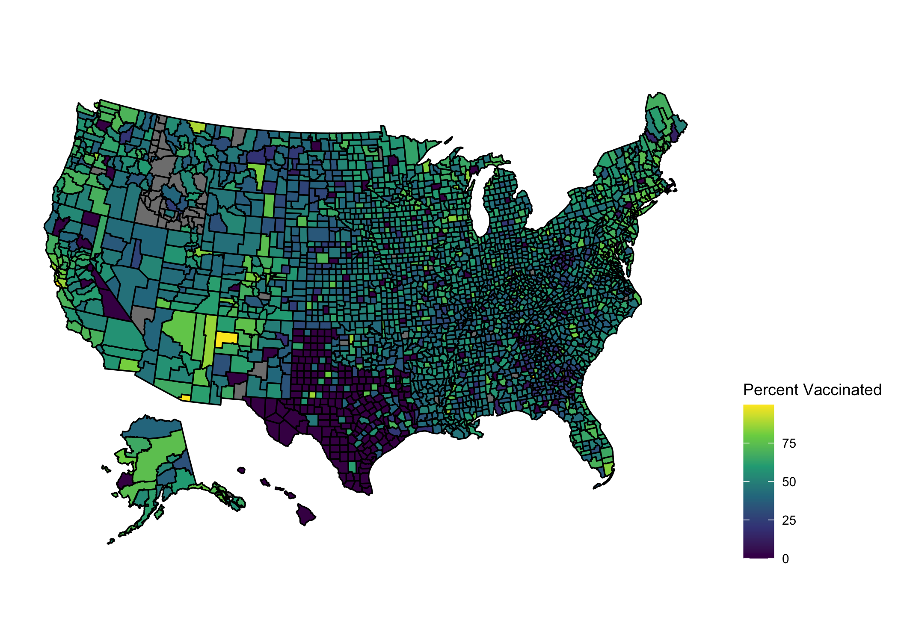
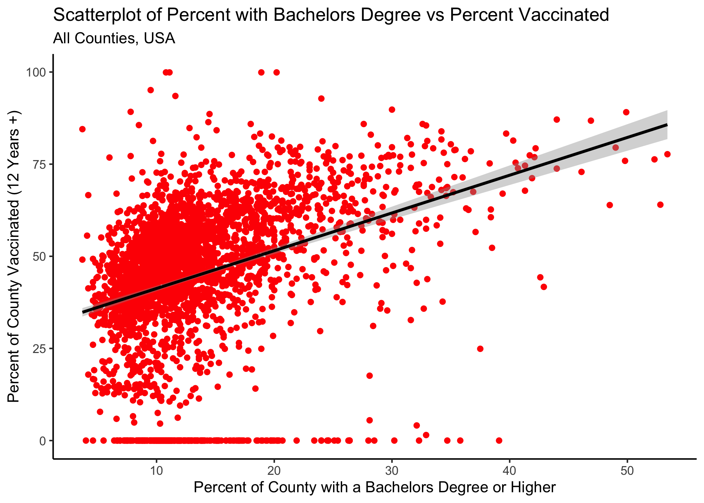
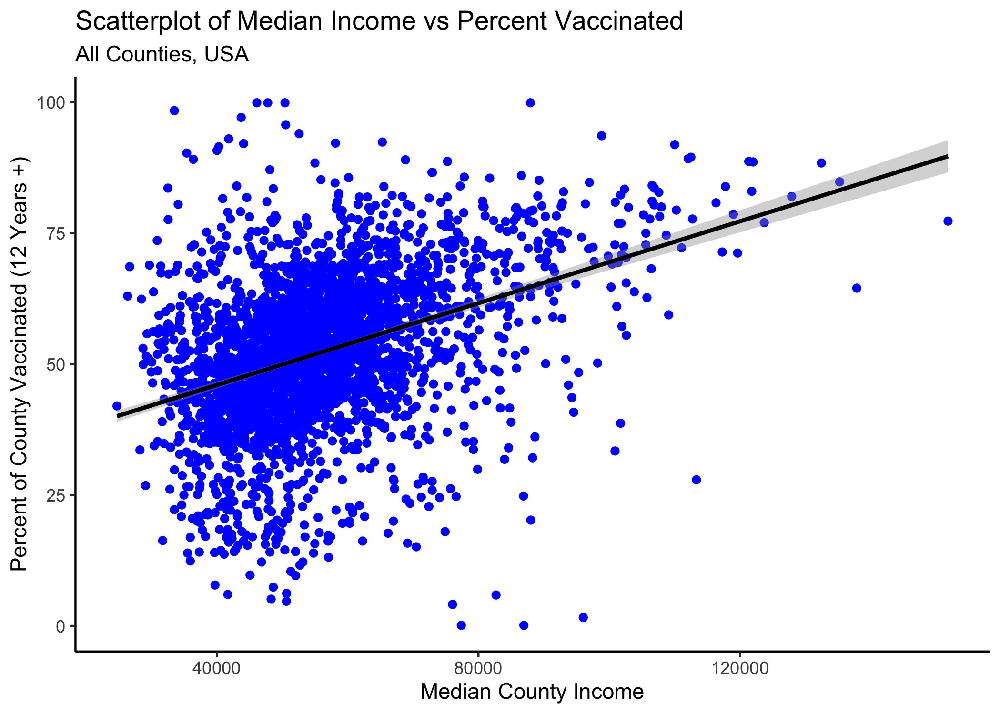
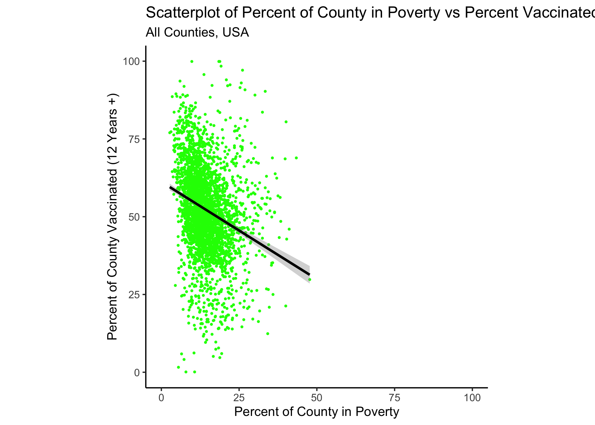
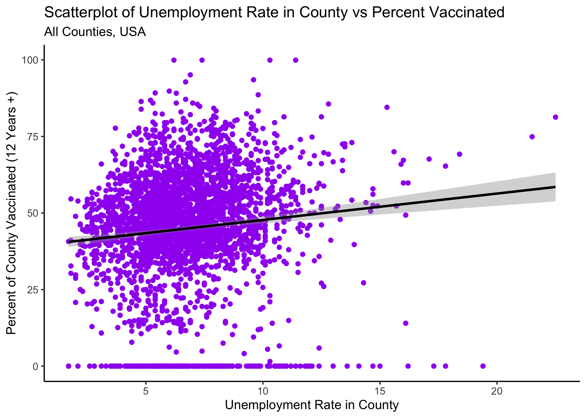
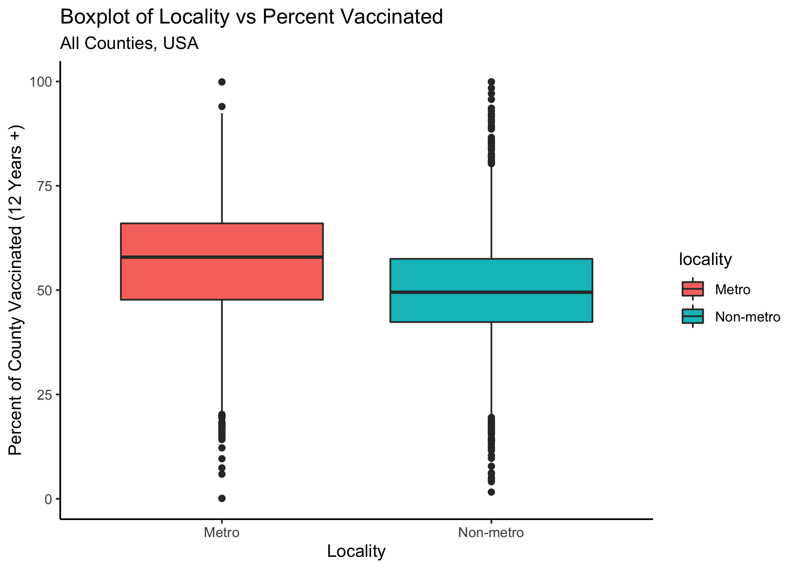

##Introduction

Low COVID-19 vaccination uptake continues to be an issue in battling the pandemic in the United States and througout the world. Studies have explored charactersitics of those individuals who decide not to be vaccinated. Several sources have reported the relationship between education level and COVID-19 vaccination the individual level using data from surveys and qualitative research. KHN released a report on June 11 that outlines the profile of the unvaccinated. They state that “compared to those who have received a covid-19 vaccine, unvaccinated adults are younger, less educated, more likely to be republicans, people of color, and uninsured.” Although this has been examined using surveys from individual participants on a smaller scale, there are no current reports or published papers that have studied this relationship using aggregate data from all counties in the US. 

The following analysis aims to examine the relationship between education level and vaccination rate (for people over age 12) at the county level for all counties in the 50 US states. Public data from CDC on vaccination rates by county and other county characteristics that are available through several different sources on the USDA’s Economic Research website were used for the analysis. This analysis could provide more information on the association between education and vaccination rate on a larger scale. 


##Methods

The main outcome for this analysis is percent of eligible people (age 12+) in a county that have been fully vaccinated. It was obtained from the CDC’s open-source dataset, "COVID-19 Vaccinations in the United States, County." This dataset “represents all vaccine partners including jurisdictional partner clinics, retail pharmacies, long-term care facilities, dialysis centers, Federal Emergency Management Agency and Health Resources and Services Administration partner sites, and federal entity facilities.” The data represents vaccination percentages up to 09/29/2021.

The main exposure for the analysis is percent of adults in each county who have a bachelors degree or higher. The most current county level data on education is available on the USDA’s Economic Research website. This dataset includes information on education level for all years.  I We subset the data to only include observations from the most current year. The most current calculations of education level by county are 5-year averages based on 2015-2019 and they come from the Census Bureau’s American Community Survey. 

There are other possible confounders that we are interested in examining including poverty, unemployment, median household income, locality (urban or rural) and health insurance rate. In order to obtain this information, data was obtained from a few more sources. The first three variables are available through datasets housed in the USDA Economic Research Service website. The county poverty estimates are model-based estimates from the U.S. Census Bureau's Small Area Income and Poverty Estimate (SAIPE) program. The county unemployment rates are from the Bureau of Labor Statistics (BLS) Local Area Unemployment Statistics (LAUS) program. The county median household income variable comes from the U.S. Census Bureau's Small Area Income and Poverty Estimate (SAIPE) program. The locality (urban or rural) variable comes from from the Rural-Urban Continuum Codes Dataset which is also managed by USDA.

In order to explore the possible relationship between education level and vaccination rates at the county level, data was extracted from the several sources mentioned above and then merged together. Most county level data include a Federal Information Processing Standards (FIPS) number.  This variable was used as the ID variable when merging the datasets. After merging the data, cleaning and processing was performed. The data was subset to only include the 50 states and DC. 

##Statistical Analysis 

Medians and interquartile ranges (IQRs) were calculated for the main outcome and other continuous covariates. Frequencies and proportions were calculated for the one categorical variable, locality. The maps package in R was used to geographically plot vaccination rates for each county in the US. We used scatter plots and linear regression overlays to display the linear relationship between county vaccination rate over twelve years of age and each continuous variable.  Stratified boxplots were used to graphically display differences in the outcome with regard to the one categorical variable, locality. 

Simple linear regression models were used to examine the relationship between each covariate and the outcome. We present regression beta coefficients and p-values for each of these crude model estimates. A multivariate regression model was used to calculate adjusted estimates for each covariate and the outcome. Performance statistics were calculated for each regression model. All modeling was performed using the R package, tidymodels.  


##Results: Descriptive Statistics 
After cleaning the data and subsetting to only counties from the US mainland and Alaska/Hawaii, the sample had 3,141 observations which represent each county. The median (IQR) vaccination rate for those age twelve and older for all US counties by September 29, 20021 was 47.4% (38%-57%). The median (IQR) bachelor’s degree percentage for all US counties was 11.8% (9.2%-15.6%).  The median (IQR) unemployment rate was 6.5% (5.2-8),  poverty rate was 13.4% (10.4-17.5), and median household income was 53,341 (46,243-62,059). The medians and IQRs for all continuous variables are displayed in Table 1. Regarding locality, the one categorical variable,  a majority (63%) of counties in the US were classified as non-metro.

Figure 1 displays vaccination rates for each county on the US map. The darker (purple) shading indicates lower vaccination rates closer to 0 and the lighter (yellow) shades indicate higher vaccination rates closer to 100. Here we see a cluster of counties with low vaccination rates in the southwest region, specifically in the state of Texas.


```{r summary_table,  echo=FALSE}
resulttable=readRDS("../../results/summarytable.rds")
knitr::kable(resulttable, caption = 'Table 1. Descriptive Statistics for US Counties')
```

###Figure 1. Map of US County Vaccination Rates for Residents Age 12+ by 09/29/2021
```{r result, echo=FALSE}

```


##Results: Simple Linear Regression Models

Main Exposure: Education
The figures and tables below examine the bivariate associations between each predicator and the outcome. Looking at the main exposure, education, we see that a one unit increase in percent of county with bachelor’s degree is associated with 1.02 unit increase in vaccination rate (p< 0.0001). This is displayed graphically in the scatterplot and linear regression overlay in figure 2. Table 3 shows the performance statistics on this model. The simple model had an r-squared value of 0.12 and an AIC of 26673.85.

Simple Models with Covariates
A one unit increase in county median income is associated with a slight increase (0.0004) in vaccination rate (p< 0.0001). This is displayed graphically in the scatterplot and linear regression overlay in figure 3. Regarding poverty rate, we see that a one unit increase in poverty rate is associated with a .78 decrease in vaccination rate (p< 0.0001). This is displayed graphically in the scatterplot and linear regression overlay in figure 4. A one unit increase in unemployment rate is associated with a 0.86 decrease in vaccination rate (p< 0.0001). This is displayed graphically in the scatterplot and linear regression overlay in figure 5. The mean vaccination rate is 7.5 percentage points units lower in non-metro areas compared with metro areas (p< 0.0001). This is displayed graphically in the stratified boxplots in figure 6.

##Simple Linear Regression Models

Figure 2. Scatterplot and linear regression overlay with percent of county with bachelors degree as the predictor and percent of county vaccinated as the outcome
```{r resultfigure1, echo=FALSE}

```


```{r lm_fit_table,  echo=FALSE}
resulttable=readRDS("../../results/lm_fit_table.rds")
knitr::kable(resulttable, caption = 'Table 2. Results of the simple linear regression model with percent of county with bachelors degree as the predictor and percent of county vaccinated as the outcome')
```


```{r lm_fit_table2,  echo=FALSE}
resulttable2=readRDS("../../results/lm_fit_stats.rds")
knitr::kable(resulttable2, caption = 'Table 3. Performance statistics on simple model percent of county with bachelors degree as the predictor and percent of county vaccinated as the outcome')
```


Figure 3. Scatterplot and linear regression overlay with median household income of county as the predictor and percent of county vaccinated as the outcome
```{r resultfigure3, echo=FALSE}

```


```{r lm_fit_table5,  echo=FALSE}
resulttable5=readRDS("../../results/lm_fit_median.rds")
knitr::kable(resulttable5, caption = 'Table 4. Results of the simple linear regression model with median household income of county as the predictor and percent of county vaccinated as the outcome')
```


Figure 4. Scatterplot and linear regression overlay with poverty rate of county as the predictor and percent of county vaccinated as the outcome
```{r resultfigure4, echo=FALSE}

```


```{r lm_fit_table6,  echo=FALSE}
resulttable6=readRDS("../../results/lm_fit_poverty.rds")
knitr::kable(resulttable6, caption = 'Table 5. Results of the simple linear regression model with poverty rate of county as the predictor and percent of county vaccinated as the outcome')
```


Figure 5. Scatterplot and linear regression overlay with unemployment rate of county as the predictor and percent of county vaccinated as the outcome
```{r resultfigure5, echo=FALSE}

```


```{r lm_fit_table7,  echo=FALSE}
resulttable7=readRDS("../../results/lm_fit_unemployment.rds")
knitr::kable(resulttable7, caption = 'Table 6. Results of the simple linear regression model with poverty rate of county as the predictor and percent of county vaccinated as the outcome')
```


Figure 6. Stratified Boxplots of locality (metro or non-metro) and percent of county vaccinated
```{r resultfigure6,  echo=FALSE}

```


```{r lm_fit_table8,  echo=FALSE}
resulttable8=readRDS("../../results/lm_fit_locality.rds")
knitr::kable(resulttable8, caption = 'Table 7. Results of the simple linear regression model with locality (metro or non-metro) as the predictor and percent of county vaccinated as the outcome')
```


##Results: Multivariate Regression Model
Table 8 below displays the results to the multivariate regression model.  When controlling for other covariates, a one unit increase in percent of county with a bachelor’s degree was associated with 0.82 unit increase in vaccination rate (p< 0.0001). Table 9 shows the performance statistics on the multivariate regression model with all predictors. Here we see that the r-squared value was 0.16 and the AIC was 26534.57. The multivariate model had a higher r-squared value and a lower AIC compared witht the simple model, indicating that it might be a better fit, but model improvements will be made in the next steps to assure that we are using the best model.  


##Multivariate Linear Regression Model

```{r lm_fit_table3,  echo=FALSE}
resulttable3=readRDS("../../results/lm_fit_table2.rds")
knitr::kable(resulttable3, caption = 'Table 8. Results of multivariate regression model with all predictors')
```


```{r lm_fit_table4,  echo=FALSE}
resulttable4=readRDS("../../results/lm_fit_stats2.rds")
knitr::kable(resulttable4, caption = 'Table 9. Performance statistics on multivariate regression model with all predictors')
```

