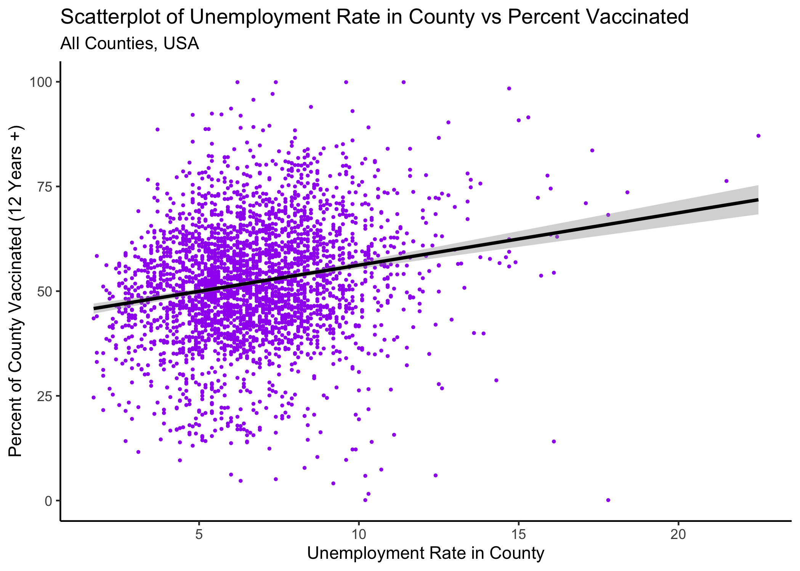
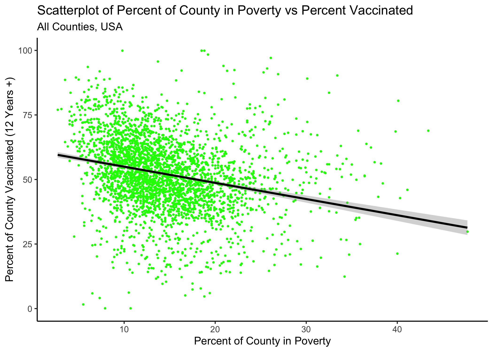
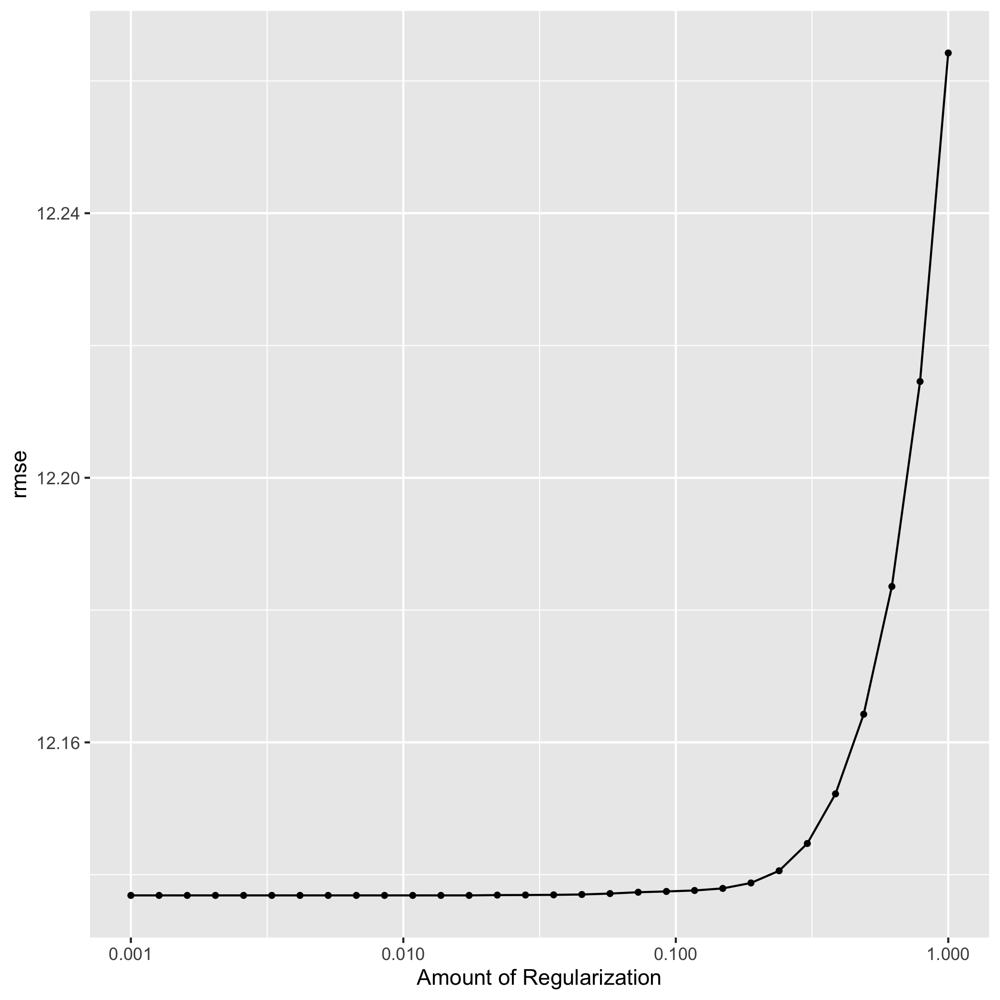
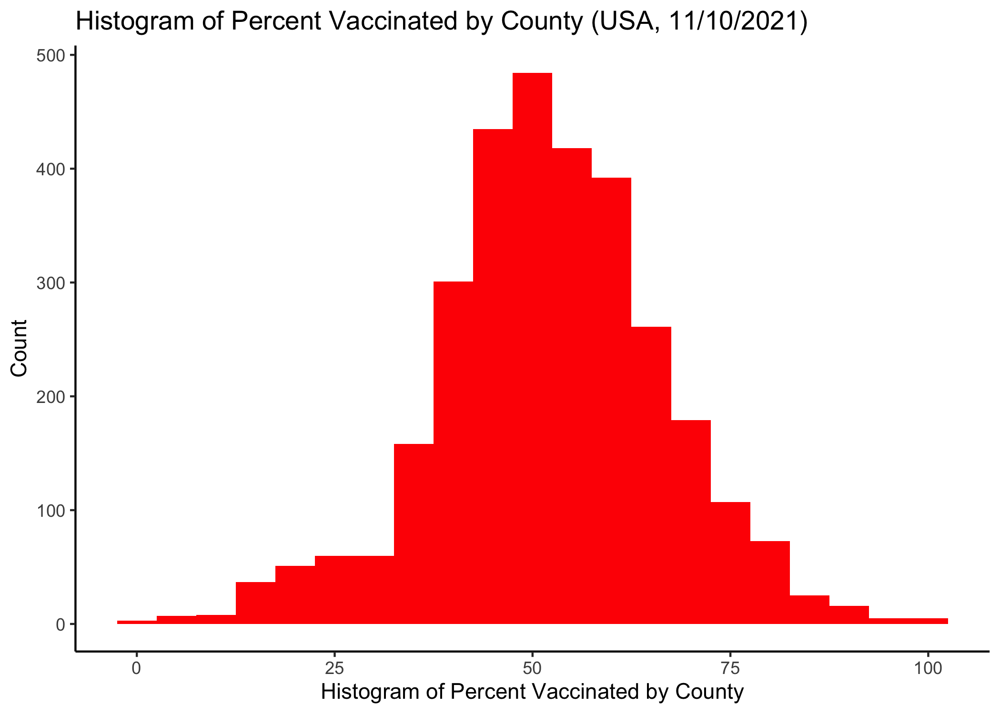
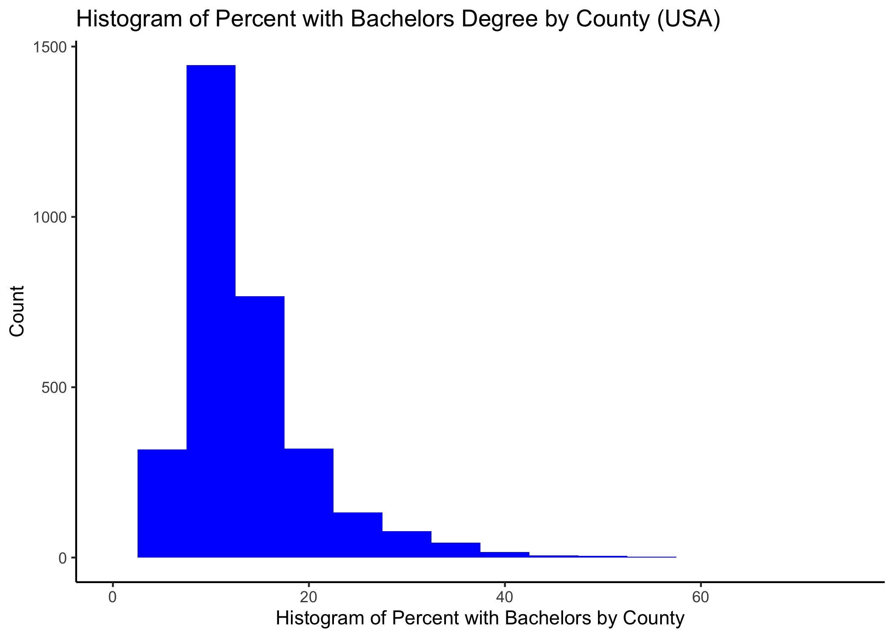
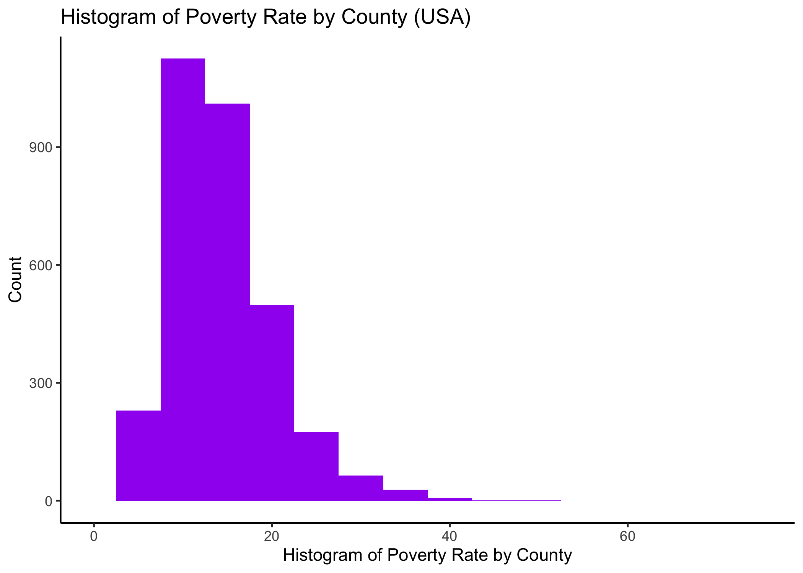

### Descriptive Statistics


<div style="margin-bottom:50px;">
</div>

```{r summary_table2,  echo=FALSE}
resulttable=readRDS("../../results/summarytable2.rds")
knitr::kable(resulttable, caption = 'Table 1. Median Vaccination Rate by County, USA, 11/10/2021')
```

<div style="margin-bottom:100px;">
</div>


#### Below we display the scatter plots and linear regression overlays for all other covariates that did not have plots included in the final manuscript.


<div style="margin-bottom:50px;">
</div>


Figure 1. Scatterplot and linear regression overlay with median household income as the predictor and percent of county vaccinated as the outcome
```{r resultfigure1, echo=FALSE}
knitr::include_graphics("../../results/resultfigure_median_income.png")
```

<div style="margin-bottom:100px;">
</div>


<div style="margin-bottom:50px;">
</div>


Figure 2. Scatterplot and linear regression overlay with unemployment rate as the predictor and percent of county vaccinated as the outcome
```{r resultfigure2, echo=FALSE}

```

<div style="margin-bottom:100px;">
</div>


Figure 3. Scatterplot and linear regression overlay with unemployment rate as the predictor and percent of county vaccinated as the outcome
```{r resultfigure3, echo=FALSE}

```

<div style="margin-bottom:100px;">
</div>


### Modeling

<div style="margin-bottom:50px;">
</div>

#### Correlation Matrix
Median income and percent poverty are highly correlated (-0.77). Further, percent bachelors is strongly correlated with median income (0.62). We decided to remove median income due the strong correlation with both our main predictor and percent poverty.


```{r summary,  echo=FALSE}
resulttable=readRDS("../../results/corr_mat.rds")
knitr::kable(resulttable, caption = 'Table 2. Correlation Matrix for all Variables Considered in Model')
```

<div style="margin-bottom:50px;">
</div>


### LASSO (Resampling)
Before running the LASSO and Decision Tree Models, we used a 5-fold cross-validation, 5 times repeated, creating a resample object for the training data with these specifications. We ran a LASSO model, training 30 penalized linear regressions in order to tune the model to select our best fit. We visualize the validation set metrics by plotting the RMSE against the range of penalty values in figure 4. This plots shows that model performance is generally better at the smaller penalty values. This suggests that the majority of the predictors are important to the model. We also see a steep increase in the RMSE towards the highest penalty values. This happens because a large enough penalty will remove all predictors from the model, causing the predictive accuracy to drop. After running the LASSO model, all predictors remained in the model. The best performing LASSO model had a penalty of 0.0452 and RMSE of 12.2, indicating that it performed better than the null model. We can see the optimal penalty where all the lines meet on the figure on the right.


<div style="margin-bottom:50px;">
</div>

Figure 4. Lasso Tuning Plots and Model Diagnostics




<div style="margin-bottom:50px;">
</div>


### Decision Tree 
We ran a decision tree model using the same 5-fold cross-validation above and tuned the hyperparameters to improve the model performance. The best performing Decision Tree model had a cost complexity of 0.000562, tree depth of 8 and RMSE of 12.7, indicating that it performed better than the null model, but not quite as well as the LASSO. We also used the decision tree model to estimate variable importance. This can be seen in figure 5. Here we see that our main predictor, percent with bachelor’s degree appears to be most important, while locality is the least important in the model.  

<div style="margin-bottom:50px;">                       
</div>
Figure 5. Decision Tree Plot of Important Variables and Model Diagnostics

<left>
{width=70% }


<div style="margin-bottom:50px;">
</div>


<div style="margin-bottom:50px;">
</div>


### Multivariate Linear Regression and Simple Linear Regression Model Diagnostics

We first calculated the RMSE for the null model, which equaled 14.5. Then we ran a full model with all predictors and plotted diagnostics to compare the fits with the null model. The RMSE for the model with all predictors was 12.1, indicating that the full model performed better at reducing the RMSE than the null model. We repeated these steps again, but for a model with only the main predictor and calculated RMSE of 12.8, indicating that the simple model performed better than the null, but not quite as well as the full model. Below are the the diagnostic plots for the complex model and the simple model.

<div style="margin-bottom:50px;">                       
</div>
Figure 6. Model Diagnostics for Full Model and Simple Model on Train Data


<div style="margin-bottom:50px;">
</div>


<div style="margin-bottom:50px;">
</div>

### Univariate Models with Other Predictors
We also ran univariate models with our other predictors and plotted diagnostics and calculated the RMSE for each. For the univariate model with only unemployment and our outcome, the RMSE was 14.2, which is close to the RMSE of the null model, which was 14.5. This suggests that it might not be adding much to the model. For the univariate model with only poverty and our outcome, the RMSE was 14.0, which is also close to the RMSE of the null model, suggesting that it might not be adding much to the model. For the univariate model with only locality and our outcome, the RMSE was 14.2, suggesting that it might not be adding much to the model.

<div style="margin-bottom:50px;">
</div>
Figure 7. Model Diagnostics for Simple Models (Unemployment and Poverty) on Train Data 


<div style="margin-bottom:50px;">
</div>


<div style="margin-bottom:50px;">
</div>


<div style="margin-bottom:50px;">
</div>


### Final Model 
After testing and plotting diagnostics on the models described above, we see that most of the models do not strongly predict our outcome or reduce the RMSE. Taking all metrics and plots into consideration, we decide that the simple univariate model with percent of population with a bachelor’s degree as the chosen model to answer our main question and best fit the data. We run a final fit on our test data using this simple model and present the performance statistics and diagnostic plots below. The RMSE error for the simple model on the testing data was 12.4, while it was 12.1 on the simple model which was fit to the training data. The residual plot on this simple model below displays the residuals to be appropriately scattered with only a few outliers, suggesting that the model is a decent fit. The predicted vs observed plot on the left shows that the data does not completely fall on a 45 degree angle which is expected given the small increment in which the RMSE changes in the simple model relative to the null.
<div style="margin-bottom:50px;">
</div>

Figure 8. Left: Predicted vs Observed from Final Model with only percent bachelor's degree on test data. Right: Predicted vs Observed from Final Model with only percent bachelor's degree on Test Data


<div style="margin-bottom:50px;">
</div>


### Additional Descriptive Plots that Explore the Distribution of Each Variable




<div style="margin-bottom:50px;">
</div>




<div style="margin-bottom:50px;">
</div>


<div style="margin-bottom:100px;">
</div>


### Table of Missingness for Each Variable in the Dataset

```{r missing,  echo=FALSE}
resulttable8=readRDS("../../results/missing.rds")
knitr::kable(resulttable8, caption = 'Table 3. Tables of Missingness Among Variables in Study (n=3,141')
```

<div style="margin-bottom:50px;">
</div>

#### Simple Linear Regression Model with Only Main Predictor Run During Exploratory Analysis Phase
Note: This was not run on the train data, but all of the data before we implemented ML methods 


```{r lm_fit_table,  echo=FALSE}
resulttable=readRDS("../../results/lm_fit_table.rds")
knitr::kable(resulttable, caption = 'Table 4. Results of the simple linear regression model with percent of county with bachelors degree as the predictor and percent of county vaccinated as the outcome')
```

<div style="margin-bottom:50px;">
</div>

```{r lm_fit_table2,  echo=FALSE}
resulttable2=readRDS("../../results/lm_fit_stats.rds")
knitr::kable(resulttable2, caption = 'Table 5. Performance statistics on simple model percent of county with bachelors degree as the predictor and percent of county vaccinated as the outcome')
```

<div style="margin-bottom:50px;">
</div>

